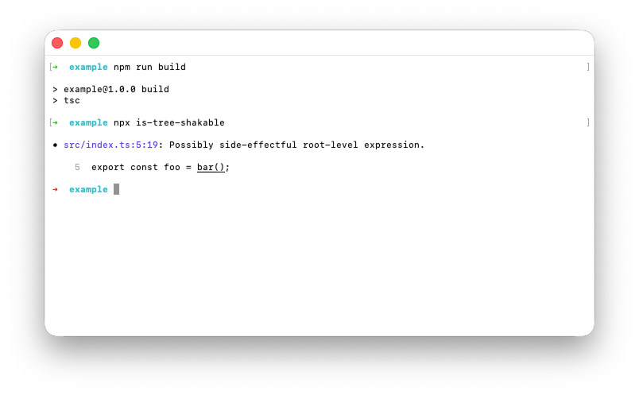

# `is-tree-shakable`

This is a command-line tree-shakability checker for JavaScript packages. Compared to alternatives, it not only reports whether a package is
tree-shakable but also pinpoints the root causes of non-tree-shakability in the JavaScript or TypeScript&nbsp;source.

  

